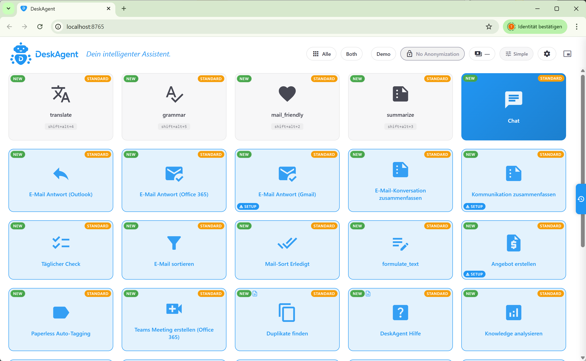

# DeskAgent

> **Your tireless helper. 100% Open Source under AGPL-3.0.**
> A local-first AI desktop assistant with deep MCP integration.
> Self-hosted, GDPR-friendly, no cloud lock-in.

[](LICENSE)
[](https://www.python.org/)
[]()
[](https://github.com/deskagent-ai/community/discussions)



## What is DeskAgent?

DeskAgent automates repetitive desk work with plain-text instructions or
your voice. It plugs multiple LLM backends (Claude, Gemini, OpenAI,
Mistral, local Qwen/Ollama) into a rich set of MCP servers covering
email, calendars, document management, accounting, payments, PDFs,
Excel, browser automation, and more.

Workflows are defined as **Markdown agents and skills** with a small
frontmatter — no UI clicking, no DSL, no vendor lock-in. Drop a `.md`
file into `agents/`, and DeskAgent picks it up. Edit it with any text
editor. Share it via Git.

DeskAgent runs as a local FastAPI server with a browser-based UI on
your own machine. It can also act as an **MCP hub** for Claude Desktop
and Claude Code, so the same agents and skills are available from
those clients.

## Why DeskAgent?

| | |
|---|---|
| 🔒 **Local-first** | Your data stays on your machine. No mandatory cloud, no telemetry. |
| 🇪🇺 **GDPR-friendly** | Optional PII anonymization layer (Microsoft Presidio) routes only redacted text to LLM providers. |
| 🔌 **MCP-native** | 22+ built-in MCP servers. Also exposes itself as an MCP hub for Claude Desktop and Claude Code. |
| 🧩 **Pluggable** | Skills, agents, MCP servers, and full plugins as drop-in folders. Plugin Exception in the license. |
| 🪶 **Plain Markdown** | Agents are Markdown with frontmatter. Read them, share them, version them. |
| 🆓 **No subscription** | AGPL-3.0 source. Self-host forever. Commercial license available on request. |

## Who is it for?

- **Freelancers & consultants** drowning in invoices, time tracking, and email replies
- **Small businesses** that want one place for email, accounting, DMS, and SEPA payments
- **Support teams** automating ticket triage and first-response drafts
- **Power users** who want to drive Outlook/Gmail/Excel/PDF from natural language
- **Developers** building local AI workflows on top of MCP

## Features

- **Multi-backend LLM**: Claude (API + Agent SDK), Gemini, OpenAI,
  Mistral, local Qwen/Ollama. Switch per agent.
## What DeskAgent can do for you

| Workflow | What it does |
|----------|--------------|
| 📧 **Email management** | Read, sort, draft replies, flag follow-ups across Outlook, Gmail, IMAP, and Microsoft Graph |
| 🧾 **Quotes & invoices** | Create offers and invoices in Billomat or Lexware from contacts, time logs, or e-mail bodies |
| 🎫 **Support tickets** | Triage and draft answers for UserEcho tickets |
| 💸 **SEPA transfers** | Turn invoice PDFs into pain.001 XML SEPA-credit-transfer batches |
| 📂 **Document archive** | OCR + auto-tagging for ecoDMS and Paperless-ngx |
| 🎤 **Voice input** | Whisper-powered hotkey dictation (optional extra) |
| 📅 **Calendar & meetings** | Read availability, create events, set up Teams meetings via Graph |
| 📊 **Excel & PDF** | Read/write spreadsheets, extract data from PDFs, render charts |
| 🌐 **Browser automation** | Drive Chrome via the Chrome DevTools Protocol from agents |

## Use DeskAgent from Claude Desktop and Claude Code

DeskAgent doubles as an **MCP hub**: it exposes all of its 22+ built-in
MCP servers through a single connection that Claude Desktop and
Claude Code can talk to. You configure DeskAgent once, and from then
on Claude has access to Outlook, Gmail, Billomat, Lexware, SEPA,
ecoDMS, Paperless, Excel, PDF, your browser, your filesystem — all
through standard MCP.

Why this matters:

- **One connection, many tools.** No need to configure 20 separate MCP
  servers in Claude Desktop. Hook up DeskAgent once.
- **The same agents from anywhere.** Workflows defined as Markdown
  agents are usable from the DeskAgent WebUI, Claude Desktop, and
  Claude Code. Write a recipe once, trigger it from whichever client
  you happen to be in.
- **Local-first.** All MCP calls stay on your machine. Claude only
  sees the redacted text DeskAgent decides to share.
- **Voice into Claude Code.** Hotkey + Whisper transcription, then
  DeskAgent forwards the task to Claude Code in the right project.

See [knowledge/doc-mcp-tools.md](knowledge/doc-mcp-tools.md) for the
full tool catalog and [knowledge/doc-setup-wizard.md](knowledge/doc-setup-wizard.md)
for the Claude Desktop / Claude Code hook-up.

## Highlights

- **Multi-backend LLM** — Claude (API + Agent SDK), Gemini, OpenAI, Mistral, local Qwen/Ollama. Pick a different backend per agent.
- **23 MCP servers** included (see full list below). Bring your own via the plugin API.
- **Hot-reloadable** Markdown agents and skills.
- **Local knowledge base** loaded into agents on demand.
- **Scheduler and email watchers** for unattended workflows.
- **Optional PII anonymization** via Microsoft Presidio (`pip install deskagent[anonymizer]`) — sensitive data is redacted before it reaches the LLM and re-inserted in the response.
- **Plugin system** with a documented API and a Plugin Exception in the license so proprietary plugins are explicitly allowed.
- **Streamdeck integration** out of the box.

## All built-in MCP servers

DeskAgent ships with the following MCP servers. The exact set of tools
per server is documented in [knowledge/doc-mcp-tools.md](knowledge/doc-mcp-tools.md).

### Email, calendar, communication

| Server | What it does | Status |
|--------|--------------|--------|
| `outlook` | Outlook Desktop via COM — read, reply, flag, move, drafts, calendar | stable |
| `msgraph` | Microsoft Graph — Outlook/Calendar/Teams via OAuth | stable |
| `gmail` | Gmail + Google Calendar via OAuth | stable |
| `imap` | Generic IMAP + SMTP with custom flags | stable |
| `telegram` | Telegram Bot API (send/receive messages, files, keyboards) | **beta** |

### Invoicing, accounting, payments

| Server | What it does | Status |
|--------|--------------|--------|
| `billomat` | Billomat API — customers, offers, invoices, articles | stable |
| `lexware` | Lexware Office API — contacts, invoices, quotations | **beta** |
| `sevdesk` | sevDesk API — contacts, invoices, vouchers | **beta** |
| `sepa` | SEPA pain.001 credit-transfer XML generation + CAMT.052 parsing | stable |

### Documents & files

| Server | What it does | Status |
|--------|--------------|--------|
| `ecodms` | ecoDMS document archive (upload, classify, search) | stable |
| `paperless` | Paperless-ngx (OCR, tagging, full-text search) | stable |
| `pdf` | Read, split, merge, render PDFs | stable |
| `excel` | Read/write `.xlsx` files | stable |
| `filesystem` | Read/write/list files, batch PDF read | stable |

### Productivity, automation, data

| Server | What it does | Status |
|--------|--------------|--------|
| `browser` | Browser automation via Chrome DevTools Protocol | stable |
| `clipboard` | System clipboard read/write/append/paste | stable |
| `chart` | Render charts from data | stable |
| `datastore` | Local SQLite key-value + document store | stable |
| `desk` | DeskAgent self-control (run agents, manage tools, status) | stable |
| `project` | Claude Code CLI integration | stable |

### Social media & support

| Server | What it does | Status |
|--------|--------------|--------|
| `userecho` | UserEcho support tickets | stable |
| `linkedin` | LinkedIn API (posts, profile, company pages) | **beta** |
| `instagram` | Instagram Graph API (posts, stories, insights) | **beta** |

**Missing a server? An MCP function that should be there but isn't?**
Contributions are very welcome. See
[knowledge/doc-creating-mcp-servers.md](knowledge/doc-creating-mcp-servers.md)
for the template and conventions, then open a pull request or a
GitHub Discussion.

## Technology stack

DeskAgent is a **Python 3.12** application. Nothing fancy — pinned versions, well-known libraries, no exotic build system.

### Server

| | |
|--|--|
| **HTTP server** | [FastAPI](https://fastapi.tiangolo.com/) + [Uvicorn](https://www.uvicorn.org/) |
| **Streaming** | Server-Sent Events (SSE) for live agent output |
| **Validation** | [Pydantic](https://docs.pydantic.dev/) v2 |
| **Tray icon** | [pystray](https://pypi.org/project/pystray/) + Pillow |
| **Optional desktop window** | [pywebview](https://pywebview.flowrl.com/) |

### MCP

| | |
|--|--|
| **Core** | [`mcp`](https://pypi.org/project/mcp/) (the official Model Context Protocol SDK) |
| **Transports** | in-process (default for built-in servers), stdio, HTTP |
| **Hub mode** | DeskAgent acts as an MCP server itself so Claude Desktop and Claude Code can talk to it |

### LLM backends

| Backend | SDK |
|---------|-----|
| Claude (Anthropic API) | [`anthropic`](https://pypi.org/project/anthropic/) |
| Claude Agent SDK | [`claude-agent-sdk`](https://pypi.org/project/claude-agent-sdk/) (optional extra; ships a proprietary `claude.exe` binary so it's not in the default install) |
| Gemini | [`google-genai`](https://pypi.org/project/google-genai/) |
| OpenAI / OpenAI-compatible | [`openai`](https://pypi.org/project/openai/) |
| Mistral | OpenAI-compatible client |
| Local Qwen / Ollama | [`qwen-agent`](https://pypi.org/project/qwen-agent/) and direct HTTP |

### Integrations (selection)

| | |
|--|--|
| **Outlook Desktop** | [`pywin32`](https://pypi.org/project/pywin32/) (Windows COM) |
| **Microsoft 365 / Graph** | [`msal`](https://pypi.org/project/msal/) + Microsoft Graph REST |
| **Gmail / Google Calendar** | [`google-api-python-client`](https://pypi.org/project/google-api-python-client/) |
| **PDF** | [`pypdf`](https://pypi.org/project/pypdf/), [`pypdfium2`](https://pypi.org/project/pypdfium2/) |
| **Excel** | [`openpyxl`](https://pypi.org/project/openpyxl/) |
| **Browser automation** | Chrome DevTools Protocol (no Selenium) |
| **Stream Deck plugin** | Vanilla JS/HTML via the Elgato SDK |

### Storage & state

| | |
|--|--|
| **Local datastore** | SQLite via Python's stdlib `sqlite3` |
| **Knowledge base** | Plain Markdown files loaded into agent context on demand |
| **Sessions** | Append-only SQLite log |
| **Config** | Versioned JSON with a 3-tier override system (system → user → plugin) |

### Optional extras

Install with `pip install deskagent[<extra>]`:

| Extra | Adds |
|-------|------|
| `[anonymizer]` | [Microsoft Presidio](https://microsoft.github.io/presidio/) + [spaCy](https://spacy.io/) for PII redaction (~500 MB with German + English models) |
| `[claude-sdk]` | The `claude-agent-sdk` package + the bundled Claude Code CLI (~230 MB, proprietary binary) |

### Voice & audio (optional)

| | |
|--|--|
| **Speech-to-text** | [openai-whisper](https://github.com/openai/whisper) (local, runs on CPU/CUDA) |
| **Hotkey** | Global hotkey via [`keyboard`](https://pypi.org/project/keyboard/) (Windows) |

### What we deliberately do NOT use

- **No JavaScript framework** in the WebUI. Vanilla HTML + CSS + JS, hand-rolled. Loads instantly, no build step.
- **No ORM**. SQL queries are short and explicit.
- **No Docker required**. DeskAgent runs as a normal Python process on your machine. You can containerize it yourself, but the project doesn't push you into a specific deployment pattern.
- **No telemetry**. The application doesn't phone home.

Full dependency list with versions: [`requirements.txt`](requirements.txt). License-compatibility notes (AGPL-friendly?): [`NOTICE`](NOTICE).

## Quick start

```bash
git clone https://github.com/deskagent-ai/community.git deskagent
cd deskagent

# macOS / Linux
./setup-unix.sh
./start.sh

# Windows (cmd.exe)
setup-python.bat
start.bat

# Windows (PowerShell) — note the leading .\
.\setup-python.bat
.\start.bat
```

WebUI opens at http://localhost:8765/.

Configure backends and API keys in `config/system.json` and
`config/backends.json` (templates are provided on first run).

### Windows: cmd.exe vs PowerShell

Both shells work, but they handle local scripts differently:

| | cmd.exe | PowerShell |
|--|---------|-------------|
| Run script in current folder | `start.bat` | `.\start.bat` |
| Why | cmd.exe auto-searches CWD | PowerShell does NOT search CWD by default (security feature) |
| Symptom if you forget `.\` | works | `start.bat : The term 'start.bat' is not recognized...` |
| Pass arguments | `start.bat --port 9000` | `.\start.bat --port 9000` |
| Execution policy issues | n/a | `.ps1` files may need `Set-ExecutionPolicy RemoteSigned -Scope CurrentUser` once |

**Recommendation for Windows users:** if you're not sure, use **cmd.exe**. The setup scripts and `start.bat` were designed and tested for cmd.exe first. PowerShell works fine too, just remember the `.\` prefix.

If you launch via the Start menu or a desktop shortcut, this doesn't matter — those use the full path.

## Platform support

DeskAgent runs on **Windows, macOS, and Linux**.

| Platform | Setup script | Status | Notes |
|----------|--------------|--------|-------|
| Windows 10/11 (x64) | `setup-python.bat` | Primary platform | All MCP servers available, plus Outlook Desktop COM and pywin32 clipboard |
| macOS (Apple Silicon + Intel) | `setup-unix.sh` | Supported | See [knowledge/doc-macos-installation.md](knowledge/doc-macos-installation.md) for Apple-Silicon-specific notes |
| Linux (x64, glibc) | `setup-unix.sh` | Supported | Tested on Ubuntu 22.04 / 24.04 |

**Prerequisites**

- Python 3.12 (3.12.8+ recommended; 3.13 is **not** supported because spaCy/thinc require 3.12 or lower)
- Git
- ~2 GB free disk space (Python + deps)
- ~500 MB extra if you install the optional `[anonymizer]` extra (spaCy + models)

On Windows, `setup-python.bat` downloads an **embedded Python 3.12** into `python/` automatically. On macOS/Linux, `setup-unix.sh` uses your **system Python 3.12** — install it first if needed:

```bash
# macOS via Homebrew
brew install python@3.12

# Ubuntu / Debian
sudo apt install python3.12 python3.12-venv

# Fedora / RHEL
sudo dnf install python3.12
```

### Windows-only features

Two MCP servers and a couple of integrations rely on the Windows API and are silently skipped on macOS/Linux:

| Feature | Why Windows-only | Alternative on macOS/Linux |
|---------|------------------|-----------------------------|
| `outlook` MCP | Uses Outlook Desktop via COM | Use `gmail`, `imap`, or `msgraph` (all platform-neutral) |
| `clipboard` MCP | Uses `pywin32` for Windows clipboard | Skills that don't depend on clipboard input still work; on macOS/Linux you can `pip install pyperclip` separately and we accept PRs to wire it in |
| Streamdeck plugin | Elgato Stream Deck SDK is Windows-only at the OS level | n/a |
| Signed installer (`.exe`/`.dmg`) | Built only for Windows and macOS | Linux users always run from source via `git clone` |

Everything else — Gmail/IMAP/MS Graph, Billomat, Lexware, sevDesk, SEPA, ecoDMS, Paperless-ngx, PDF, Excel, Browser automation, Filesystem, Datastore, Charts, Telegram, UserEcho, LinkedIn, Instagram, the FastAPI server, the MCP hub, agent and skill loading, anonymization, scheduler, watchers — is fully platform-neutral.

## Documentation

All documentation lives in this repository. There is no separate
documentation site.

For developers and integrators:

- [knowledge/doc-overview.md](knowledge/doc-overview.md) — high-level architecture
- [knowledge/doc-folder-structure.md](knowledge/doc-folder-structure.md) — folder layout
- [knowledge/doc-startup-and-directories.md](knowledge/doc-startup-and-directories.md) — startup, CLI flags, multi-instance
- [knowledge/doc-config-reference.md](knowledge/doc-config-reference.md) — configuration reference
- [knowledge/doc-ai-backends.md](knowledge/doc-ai-backends.md) — LLM backend reference
- [knowledge/doc-mcp-tools.md](knowledge/doc-mcp-tools.md) — every MCP tool, all parameters
- [knowledge/doc-creating-mcp-servers.md](knowledge/doc-creating-mcp-servers.md) — build your own MCP server
- [knowledge/doc-creating-agents.md](knowledge/doc-creating-agents.md) — build your own agent
- [knowledge/doc-agent-frontmatter-reference.md](knowledge/doc-agent-frontmatter-reference.md) — agent frontmatter fields
- [knowledge/doc-pluginsystem.md](knowledge/doc-pluginsystem.md) — plugin system
- [knowledge/doc-anonymization.md](knowledge/doc-anonymization.md) — DSGVO anonymization
- [knowledge/doc-licensing.md](knowledge/doc-licensing.md) — licensing details, including the AGPL Section 13 Notice

## How to install

| Option | For whom | How |
|--------|----------|-----|
| **Source (this repo)** | Developers, self-hosters, AGPL-friendly users | `git clone` + `start.bat` / `start.sh` (see Quick start) |
| **Pre-built installer** | Business users wanting a signed installer, auto-updater, and an AGPL-free Commercial License | https://deskagent.de |

The pre-built installer ships exactly the same code as this repository
plus a Commercial License that removes the AGPL-3.0 obligations and
includes priority support.

## License

DeskAgent is licensed under the [GNU Affero General Public License v3.0](LICENSE)
with a [Plugin Exception](LICENSE) (see the bottom of the LICENSE file).

**Short version:**

- You may use, modify, and self-host DeskAgent freely.
- You may run it as a network service for other users — including
  customers — provided you make the modified source code available
  to those users (AGPL Section 13).
- You may write proprietary plugins that talk to DeskAgent through the
  documented plugin API; the Plugin Exception makes this explicit.
- If you want to run a modified version, ship binaries, or operate a
  SaaS without the AGPL source-disclosure obligation, you can purchase
  a Commercial License from realvirtual GmbH.

**Need an AGPL-free Commercial License?**
Contact info@realvirtual.io.

## Naming and forks

The name "DeskAgent" is a generic descriptive term and is not registered
as a trademark. You are legally free to fork and redistribute, including
under the same name. As a courtesy and to avoid user confusion, please
consider using a distinct name for your fork (e.g. "MyForkName, based on
DeskAgent"). This is a request, not a legal requirement.

## Contributing

Pull requests, bug reports, MCP servers, and agent definitions are
welcome. See [CONTRIBUTING.md](CONTRIBUTING.md) for the full guide.

By opening a pull request you confirm the contribution terms described
in [CONTRIBUTING.md](CONTRIBUTING.md) (inline statement, no separate
agreement to sign).

## Security

Please do not open public issues for security vulnerabilities. See
[SECURITY.md](SECURITY.md) for the disclosure process.

## Commercial distribution and support

For signed installers, auto-updater, AGPL-free Commercial License, and
priority support, contact **info@realvirtual.io**.

---

Built by [realvirtual GmbH](https://realvirtual.io). © 2026.
